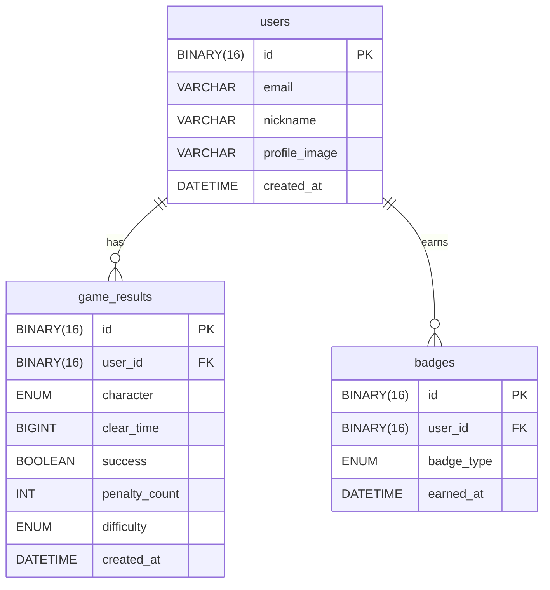

# Donut Rush — ERD

## 테이블 관계도

## 도메인 설명

### users
| 컬럼 | 타입 | 설명 |
|------|------|------|
| id | BINARY(16) | UUID PK (BaseUUIDEntity) |
| nickname | VARCHAR | 유저 닉네임 (unique) |
| profile_image | VARCHAR | Google 프로필 이미지 URL (nullable) |
| created_at | DATETIME | 가입 일시 |

### game_results
| 컬럼 | 타입 | 설명 |
|------|------|------|
| id | BINARY(16) | UUID PK |
| user_id | BINARY(16) | users.id FK |
| character | ENUM | BRUMP \| JEONGEUN \| BUDIN |
| clear_time | BIGINT | 클리어 소요 시간 (밀리초) |
| success | BOOLEAN | 클리어 성공 여부 |
| penalty_count | INT | 오답 입력 횟수 |
| difficulty | ENUM | EASY \| NORMAL \| HARD |
| created_at | DATETIME | 게임 종료 일시 |

### badges
| 컬럼 | 타입 | 설명 |
|------|------|------|
| id | BINARY(16) | UUID PK |
| user_id | BINARY(16) | users.id FK |
| badge_type | ENUM | BASIC_CLEAR \| NO_PENALTY \| SPEED |
| earned_at | DATETIME | 뱃지 획득 일시 |

## 뱃지 조건
| BadgeType | 조건 |
|-----------|------|
| BASIC_CLEAR | success == true |
| NO_PENALTY | success == true && penaltyCount == 0 |
| SPEED | success == true && clearTime < 60,000ms |
